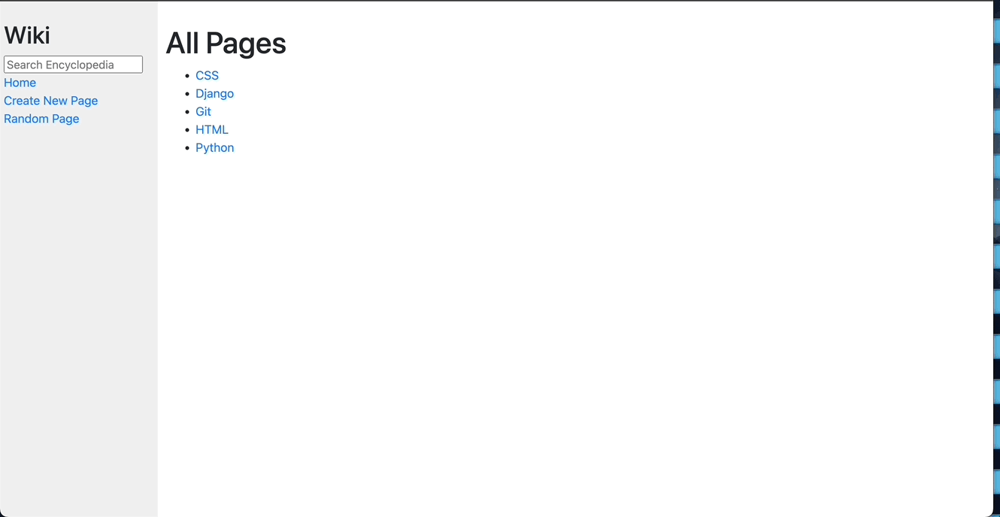

# Demo

# Purpose

This project aims to get acquainted with the Django framework in python by simulating a wiki-like page. In this project, users can create new wiki pages, edit existing ones, and so on. This information is also reflected on the side navigation bar.

# Contents

[Django File Structure](https://techvidvan.com/tutorials/django-project-structure-layout/)

1. encyclopedia/ - Django app folder.
    1. static/ - Contains css files for styling.
    2. templates/ - Contains html files for pages. Takes advantage of Jinja templating, to reduce redundant code. Main html file is layout.html.
    3. urls.py - Defines what routes to use in views.py given some url path.
    4. util.py - Functions that save/retrieve documents.
    5. views.py - Defines what to do when a specific route is visited.

2. entries/ - Markdown documents containining all new entries and default entries.
3. wiki/ - Project folder for Django, contains configurations files for project.
4. manage.py - Command line utility to run project.
5. requirements.txt - Librarys to run project.